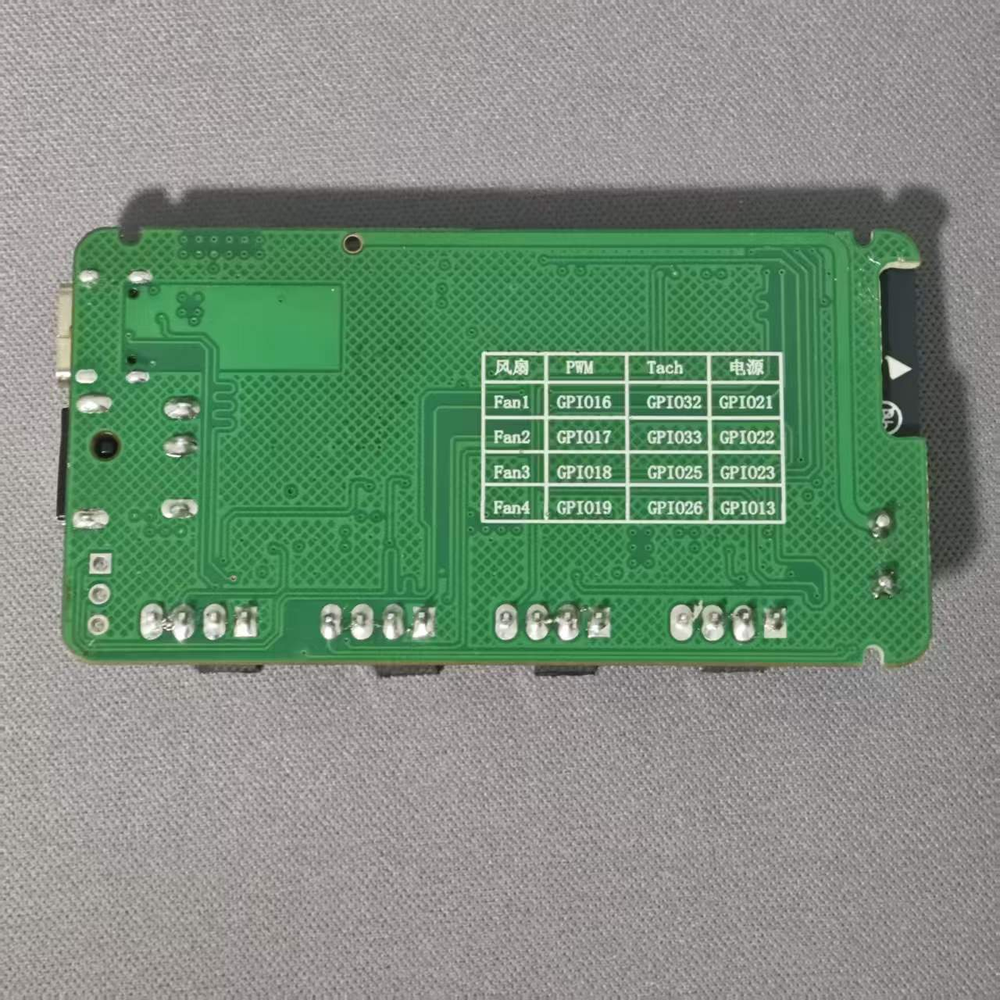
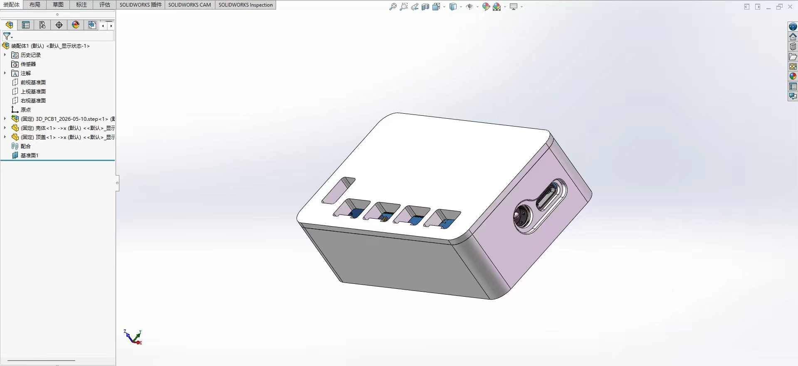

# HomeAssistant-PWM-Fan-Controlx4

## 项目简介

 HomeAssistant-PWM-Fan-Controlx4 是一个基于 ESPHome 的 PWM 风扇控制器项目。该控制器支持接入 Home Assistant，实现 4 路风扇的独立调速与智能联动控制。

## 主要功能

- 通过 ESPHome 集成 HomeAssistant 控制
- 支持 4 路风扇独立 PWM 调速 转速显示
- 可通过 HomeAssistant 自动化联动温湿度传感器，实现环境温度/湿度驱动风速调节
- 可通过 SSH 读取设备 CPU 温度，并结合 HomeAssistant 自动化实现风速控制

## 项目展示

  <table>
    <tr>
      <td width="33%" style="padding: 10px;">
        
        <!-- 
<small>实物图顶部</small>
 -->
      </td>
      <td width="33%" style="padding: 10px;">
        
        <!-- 
<small>实物图底部</small>
 -->
      </td>
      <td width="33%" style="padding: 10px;">
        
        <!-- 
<small>带外壳</small>
 -->
      </td>
    </tr>
  </table>

## 控制器硬件实现原理

本控制器的核心硬件设计如下：

- 使用 `TPS22810DBVR` 实现风扇电源控制。
  - 该芯片可直接切断风扇电源，从而有效解决风扇无法完全停转的问题。
- 12V 转 5V 电源采用 `TPS5430DDAR` DC-DC 降压芯片。
  - 该方案效率高、发热低。
- 5V 转 3.3V 电源采用 `AMS1117-3.3` 线性稳压器。
  - 该方案结构简单、成本低，适用于为 3.3V MCU提供稳定电源。
- 板载 `CH340C` USB 转串口芯片。
  - 只需通过 Type-C 接口连接电脑即可直接烧录固件。

## IO 接口说明

| 风扇 | PWM 输出 | Tach 输入 | 电源管理 |
| ---- | -------- | --------- | -------- |
| Fan1 | GPIO16   | GPIO32    | GPIO21  |
| Fan2 | GPIO17   | GPIO33    | GPIO22  |
| Fan3 | GPIO18   | GPIO25    | GPIO23  |
| Fan4 | GPIO19   | GPIO26    | GPIO13  |

## 交流群

  

## 请二刺螈本螈喝咖啡

  <table>
    <tr>
      <td width="50%" style="padding: 10px;">
        
        
<small>微信</small>

      </td>
      <td width="50%" style="padding: 10px;">
        
        
<small>支付宝</small>

      </td>
    </tr>
  </table>

## 二创项目

欢迎大家对本项目的硬件、软件甚至外壳进行二创和优化。如果你希望将自己的 Fork 项目展示在本项目中，请先联系我并提交你的修改说明。

审核通过后，你的项目将被展示在下方区域。

| 项目地址 | 项目说明 |
| ---- | -------- | 
| None | None   |

## 开源许可证

本项目采用 [MIT License](./LICENSE) 开源许可证。

有关详细信息，请参阅 [LICENSE](./LICENSE) 文件。
