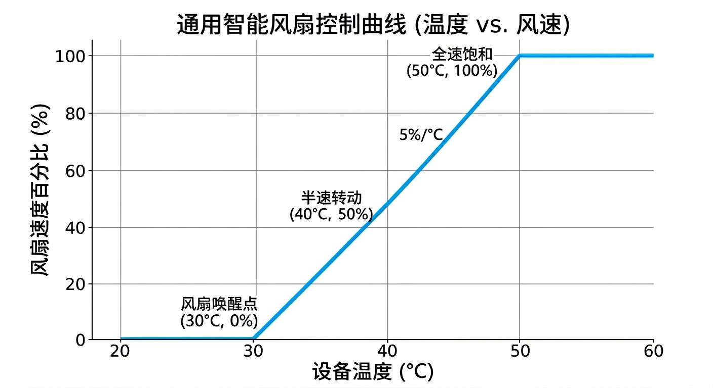
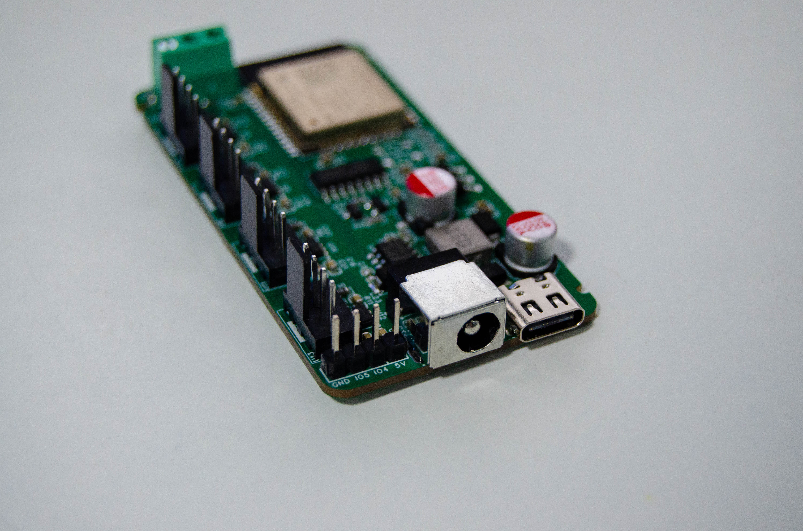
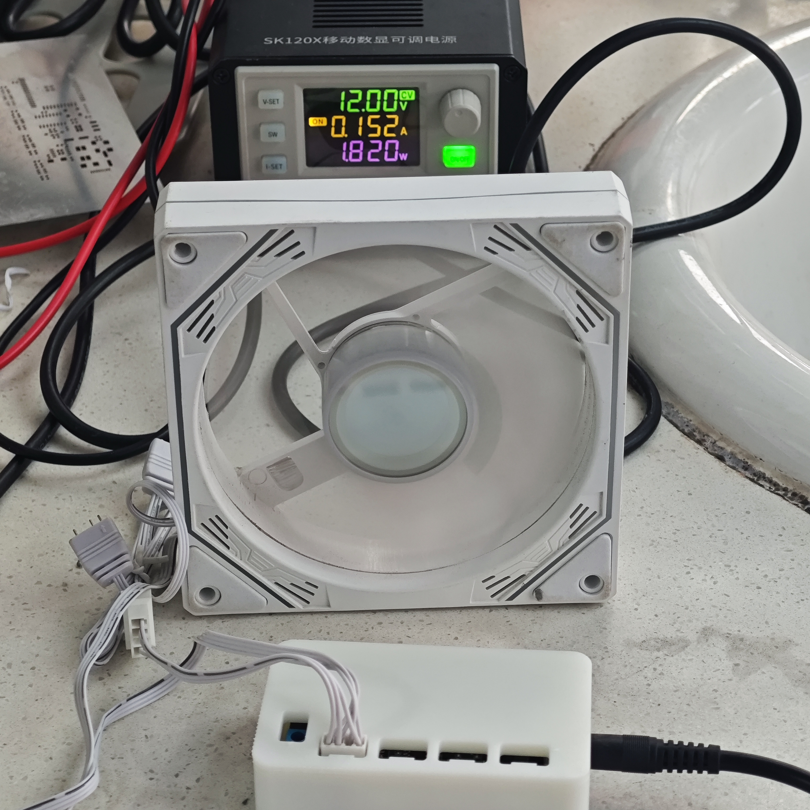
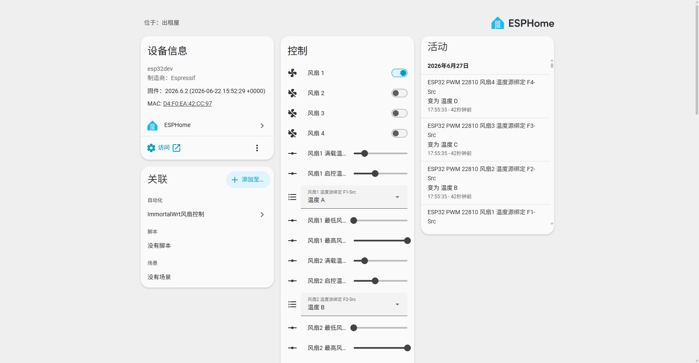
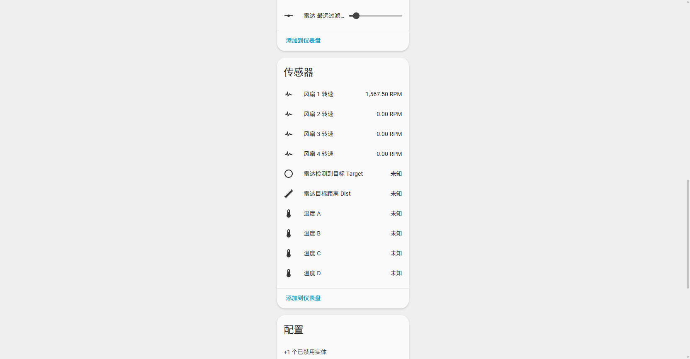

# HomeAssistant-PWM-Fan-Controlx4

<p align="center"><a href="readme.md">中文</a> · <a href="README_EN.md">English</a></p>

一个基于 ESPHome 的 4 路 PWM 风扇控制器，支持 Home Assistant、Web 控制面板和 HTTP REST API。每路风扇都可以独立开关、调速和读取转速；v2.0 固件还支持 DS18B20 温度控制及 LD2402G 毫米波雷达扩展。

## 1. 固件版本与下载

### 1.1 先确认硬件版本

刷写前请先确认主控硬件与固件匹配：

> **成品设备通常采用单核设计，只能刷入 `v1.0 单核` 或任意 `v2.0` 固件。请勿将 `v1.0 双核` 固件刷入单核设备，否则设备将无法启动。**

### 1.2 固件选择

| 固件版本 | 处理器 | 主要功能 | 适用场景 |
|:---------|:------:|:---------|:---------|
| **v1.0 双核** | 双核 | 4 路风扇控制、转速显示、Web、HTTP API、诊断、BLE Proxy | 确认使用双核硬件，且需要较高性能 |
| **v1.0 单核** | 单核 | 4 路风扇控制、转速显示、Web、HTTP API、诊断、BLE Proxy | v1.0 单核硬件，使用 HA 自动化控温 |
| **v2.0 Basic** | 单核 | 基础 4 路风扇控制、转速显示、Web、HTTP API、诊断、BLE Proxy | v2.0 硬件，不使用本地温度和雷达 |
| **v2.0 DS18B20** | 单核 | v2.0 Basic 功能 + 最多 4 个 DS18B20 温度传感器 + 本地自动调速 | 服务器、机柜、NAS 等需要脱离 HA 独立控温的场景 |
| **v2.0 DS18B20+雷达** | 单核 | DS18B20 版本功能 + LD2402G 24GHz 毫米波人体存在检测 | 需要按人体存在状态联动的智能家居场景 |

所有版本均支持：

- 4 路风扇独立 PWM 调速，速度范围为 1-100%，支持完全断电停转。
- 4 路风扇转速（RPM）读取。
- Home Assistant ESPHome 集成、Web 控制面板和 HTTP REST API。
- 运行时间、Wi-Fi 信号、IP 地址、SSID 和 ESPHome 版本等诊断实体。
- 蓝牙代理（BLE Proxy），用于扩展 Home Assistant 的蓝牙覆盖范围。

### 1.3 功能对比

| 功能 | v1.0 双核 | v1.0 单核 | v2.0 Basic | v2.0 DS18B20 | v2.0 + 雷达 |
|:-----|:--------:|:---------:|:----------:|:------------:|:-----------:|
| 4 路 PWM 风扇控制 | ✅ | ✅ | ✅ | ✅ | ✅ |
| 完全断电停转 | ✅ | ✅ | ✅ | ✅ | ✅ |
| 实时转速显示 | ✅ | ✅ | ✅ | ✅ | ✅ |
| Web 界面 / HTTP API | ✅ | ✅ | ✅ | ✅ | ✅ |
| 诊断实体 | ✅ | ✅ | ✅ | ✅ | ✅ |
| 蓝牙代理 | ✅ | ✅ | ✅ | ✅ | ✅ |
| DS18B20 温度控制 | - | - | - | ✅ | ✅ |
| LD2402G 毫米波雷达 | - | - | - | - | ✅ |

### 1.4 下载预编译固件

固件由 GitHub Actions 自动编译并发布，无需手动打包：

[前往 GitHub Releases 下载](https://github.com/YUAXI/HomeAssistant-PWM-Fan-Controlx4/releases)

每个版本包含以下 3 类文件：

| 文件后缀 | 用途 |
|:---------|:-----|
| `.firmware.bin` | 常规刷写使用的标准固件 |
| `.firmware.factory.bin` | 完整恢复出厂设置时使用的工厂固件 |
| `.firmware.ota.bin` | 已联网设备的 OTA 升级固件 |

Release 中的版本名称与配置文件对应关系如下：

| Release 名称 | 配置文件 |
|:-------------|:---------|
| `v1.0-dual-core` | `firmware/v1.0/dual-core/config.yaml` |
| `v1.0-single-core` | `firmware/v1.0/single-core/config.yaml` |
| `v2.0-basic` | `firmware/v2.0/single-core/basic/config.yaml` |
| `v2.0-ds18b20` | `firmware/v2.0/single-core/ds18b20/config.yaml` |
| `v2.0-ds18b20-radar` | `firmware/v2.0/single-core/ds18b20-radar/config.yaml` |

### 1.5 自定义编译

需要修改 Wi-Fi、实体名称或其他 ESPHome 配置时，可以直接编辑上表中的 `config.yaml`，然后使用 ESPHome 编译和刷写。所有配置文件都使用 ESP32 DevKit、ESP-IDF 框架；v1.0 单核和 v2.0 固件明确启用了单核运行配置。

## 2. 快速上手

### 2.1 供电

| 供电方式 | 接口 | 电压 | 说明 |
|:---------|:-----|:-----|:-----|
| **DC 接口（推荐）** | DC 座 | 12V / 2A 以上 | 正常运行，同时为风扇和 ESP32 供电 |
| Type-C 接口 | USB-C | 5V | 仅用于刷写和调试，不能驱动风扇正常工作 |

### 2.2 首次配网

设备上电后会创建无密码 Wi-Fi 热点 `ESP32-Fan-22810`：

1. 使用手机或电脑连接 `ESP32-Fan-22810`。
2. 浏览器访问 `http://192.168.4.1` 或 `http://esp32pwm22810.local`。
3. 在 Wi-Fi 配置向导中选择目标 Wi-Fi 并输入密码。
4. 设备连接成功后会自动重启。

如果需要跳过首次配网，可以在刷写前于配置文件中预设 `wifi.ssid` 和 `wifi.password`。

### 2.3 刷写固件

使用 Type-C 连接设备和电脑，选择对应硬件的固件，使用 ESPHome 刷写工具或 `esptool` 完成首次刷写。设备联网后可以使用 `.firmware.ota.bin` 进行远程升级。

### 2.4 接入 Home Assistant

先确保已安装 Home Assistant 的 ESPHome 集成：

1. 打开 **设置 → 设备与服务 → 添加集成**，搜索 **ESPHome**。
2. 选择自动发现的 `ESP32 PWM 22810`，或手动输入设备 IP 地址。
3. 输入以下配置文件中的 API 加密密钥并提交：

   ```text
   LqGIGJ3qyRc+6X6hsMe5vAms+Jyh2lOMh1FQu8yyuzk=
   ```

接入后通常会出现以下实体：

| 实体类型 | 数量 | 说明 |
|:---------|:----:|:-----|
| 风扇 | 4 个 | 独立开关和 1-100% 调速 |
| 转速传感器 | 4 个 | 单位为 RPM |
| 温度传感器 | 4 个 | 仅 v2.0 DS18B20 及雷达固件，名称为温度 A/B/C/D |
| 蓝牙代理 | 1 个 | BLE Proxy 节点 |
| 诊断实体 | 若干 | 运行时间、Wi-Fi 信号、IP、SSID、ESPHome 版本等 |

### 2.5 Web 控制面板

浏览器访问 `http://设备IP` 即可打开 Web 控制面板，不依赖 Home Assistant。面板可以查看 4 路风扇状态、独立调节风速并查看设备运行信息。

## 3. v2.0 温度与雷达功能

### 3.1 DS18B20 接线

DS18B20 接入 v2.0 板载 **GPIO14** 的 3PIN 排针，使用 1-Wire 总线：

| DS18B20 引脚 | 连接位置 |
|:------------:|:---------|
| VCC | 3.3V 或 5V |
| GND | GND |
| DATA | GPIO14 |

配置已集成上拉电阻，GPIO14 总线最多可并联 4 个 DS18B20。固件按总线索引将其命名为 **温度 A、温度 B、温度 C、温度 D**。

### 3.2 本地温度调速

本节适用于 `v2.0-ds18b20` 和 `v2.0-ds18b20-radar` 固件。接入设备后，在 Home Assistant 的 **ESP32 PWM 22810** 设备页面中，为每路风扇设置温度源和参数：

| 参数 | 作用 | 默认值 |
|:-----|:-----|:------:|
| 温度源绑定 `F-Src` | 选择未绑定或温度 A/B/C/D | 风扇 1-4 分别绑定 A-D |
| 启控温度 `T-Min` | 温度低于或等于该值时断电停转 | 30°C |
| 满载温度 `T-Max` | 温度高于或等于该值时使用最高风速 | 50°C |
| 最低风速 `F-Min` | 线性调速区间的最低风速 | 0% |
| 最高风速 `F-Max` | 线性调速区间的最高风速 | 100% |

控制逻辑：

```text
温度 ≤ T-Min                   → 断电完全关停风扇
T-Min < 温度 < T-Max           → 按温度线性比例调速
温度 ≥ T-Max                   → 以 F-Max 运行
温度读取异常                    → 保持当前风速和运行状态
```

上述参数支持掉电保持。未绑定温度源的风扇不会执行本地温控逻辑，仍可通过 Home Assistant、Web 或 HTTP API 手动控制。

### 3.3 LD2402G 雷达接口

仅 `v2.0-ds18b20-radar` 固件启用雷达串口：

| 雷达接口 | 控制器接口 |
|:---------|:-----------|
| TX | GPIO4（UART RX） |
| RX | GPIO5（UART TX） |
| 电源 / 地 | v2.0 开发者排针的 5V / GND |

串口速率为 `115200`。雷达固件提供目标存在状态和目标距离实体，并提供最近、最远距离过滤参数，默认范围为 `0.10-1.5 m`。雷达与风扇、温度控制的联动关系可在 Home Assistant 中通过自动化配置。

## 4. Home Assistant 自动化控温

v2.0 DS18B20 固件已经支持本地温控；以下方式适用于所有版本，尤其适合 v1.0，或需要使用 CPU 温度、环境温度等 Home Assistant 外部温度源的场景。

### 4.1 配置步骤

1. 打开 Home Assistant → **自动化与场景 → 创建自动化**。
2. 点击右上角 **更多 → YAML 编辑**。
3. 粘贴下方模板。
4. 将温度传感器和风扇实体 ID 替换为自己的实体后保存。

### 4.2 YAML 模板

```yaml
alias: "通用智能风扇线性调速"
description: "根据温度传感器数值线性控制风扇 PWM 占空比"
mode: restart

trigger:
  - platform: state
    entity_id: sensor.nas_temperature_x86_pkg_temp  # 需要修改

condition:
  - condition: template
    value_template: "{{ is_number(states('sensor.nas_temperature_x86_pkg_temp')) }}"  # 需要修改

action:
  - service: fan.set_percentage
    target:
      entity_id: fan.fan_1  # 需要修改
    data:
      percentage: >
          {# 需要修改 #}
        
        
        
        
        
          {{ f_min }}
        
          {{ f_max }}
        
          
          {{ result | round(0) | int }}
        
```



常见温度源示例：

| 温度来源 | 获取方式 | 示例实体 ID |
|:---------|:---------|:------------|
| 电脑 / 服务器 CPU | Glances 集成 | `sensor.nas_temperature_x86_pkg_temp` |
| 温湿度传感器 | Zigbee2MQTT / ZHA | `sensor.temperature_humidity_sensor_temperature` |
| 空调 / 暖气 | 智能空调集成 | `climate.living_air_conditioner` |
| 群晖 NAS | Synology DSM 集成 | `sensor.synology_disk_1_temperature` |
| 其他 ESPHome 设备 | ESPHome 集成 | 按实际设备填写 |

## 5. HTTP REST API

项目内置 Web Server，可以通过局域网 HTTP 请求控制风扇或读取传感器。控制命令使用 **POST**，状态读取使用 **GET**。实体名称包含中文时，URL 必须进行 UTF-8 编码。

### 5.1 实体与路径示例

ESPHome 会根据配置中的 `name` 自动生成实体 ID。以下为第 1 路风扇示例：

| 实体名称 | entity_id | URL 路径 |
|:---------|:----------|:---------|
| 风扇 1 | `fan.风扇_1` | `/fan/%E9%A3%8E%E6%89%87_1` |
| 风扇 1 转速 | `sensor.风扇_1_转速` | `/sensor/%E9%A3%8E%E6%89%87_1_%E8%BD%AC%E9%80%9F` |

如需调用其他风扇，请按配置中的实体名称替换路径。也可以优先使用 Home Assistant 的 `fan.set_percentage` 服务，避免手动处理中文 URL。

### 5.2 Python 示例

```python
import requests
from urllib.parse import quote

base = "http://10.0.20.83"  # 替换为设备 IP

# 开启 2 号风扇并设置为 50%
requests.post(f"{base}/fan/{quote('风扇 2')}/turn_on", params={"speed_level": 50})

# 关闭 2 号风扇
requests.post(f"{base}/fan/{quote('风扇 2')}/turn_off")

# 读取 1 号风扇转速
response = requests.get(f"{base}/sensor/{quote('风扇 1 转速')}")
if response.status_code == 200:
    print("当前转速:", response.json()["value"])
```

## 6. 硬件资料与接口

### 6.1 硬件文件

v2.0 为推荐硬件版本：

| 类型 | v2.0 文件 | v1.0 文件 |
|:-----|:----------|:----------|
| PCB Gerber | [gerber.zip](./hardware/v2.0/pcb/gerber.zip) | [gerber.zip](./hardware/v1.0/pcb/gerber.zip) |
| BOM 清单 | [bom.xlsx](./hardware/v2.0/pcb/bom.xlsx) | [bom.xlsx](./hardware/v1.0/pcb/bom.xlsx) |
| 立创 EDA 工程 | [project.epro2](./hardware/v2.0/pcb/project.epro2) | [project.epro2](./hardware/v1.0/pcb/project.epro2) |
| 外壳主体 | [case.STEP](./hardware/v2.0/3d-models/print/case.STEP) | [case.step](./hardware/v1.0/3d-models/print/case.step) |
| 上盖 | [top-cover.STEP](./hardware/v2.0/3d-models/print/top-cover.STEP) | [top-cover.step](./hardware/v1.0/3d-models/print/top-cover.step) |

### 6.2 风扇接口映射

| 风扇 | PWM 输出 | Tach 转速输入 | 电源管理 |
|:----:|:--------:|:-------------:|:--------:|
| Fan1 | GPIO16 | GPIO32 | GPIO21 |
| Fan2 | GPIO17 | GPIO33 | GPIO22 |
| Fan3 | GPIO18 | GPIO25 | GPIO23 |
| Fan4 | GPIO19 | GPIO26 | GPIO13 |

v2.0 额外接口：

| 接口 | 说明 |
|:-----|:-----|
| GPIO14（3PIN 排针） | DS18B20 1-Wire 温度总线 |
| 4PIN 开发者排针（5V / GND / GPIO5 / GPIO4） | 可扩展 LD2402G 雷达、RS485 等外设 |

### 6.3 硬件设计要点

- **风扇电源控制**：使用 `TPS22810DBVR` 直接切断风扇供电，实现真正的完全停转。
- **电源方案**：12V → 5V（`TPS5430DDAR` DC-DC）→ 3.3V（`AMS1117-3.3`）。
- **USB 转串口**：板载 `CH340C`，通过 Type-C 连接电脑刷写和调试。

## 7. 项目展示

<div style="text-align: center;">
  <table>
    <tr>
      <td width="25%" style="padding: 10px;"></td>
      <td width="25%" style="padding: 10px;"></td>
      <td width="25%" style="padding: 10px;"></td>
      <td width="25%" style="padding: 10px;"></td>
    </tr>
  </table>
</div>

## 8. 更新记录

| 日期 | 更新内容 |
|:-----|:---------|
| 2026-08-16 | 自动调速时温度低于或等于 `T-Min` 时断电停转，温度恢复后自动重启风扇。 |
| 2026-07-10 | DS18B20 读取异常时保持当前风速，移除异常时强制全速保护。 |
| 2026-07-01 | 全版本增加蓝牙代理；CI 自动编译并发布 Release；移除仓库中的预编译固件。 |
| v2.0 | 增加 DS18B20 温度控制、毫米波雷达固件和 v2.0 硬件设计。 |
| v1.0 | 提供 Web 界面、HTTP REST API 和诊断实体。 |

## 9. 支持与许可证

交流群二维码不再维护。

<div style="text-align: center;">
  <table>
    <tr>
      <td width="50%" style="padding: 10px;"><p><small>微信</small></p></td>
      <td width="50%" style="padding: 10px;"><p><small>支付宝</small></p></td>
    </tr>
  </table>
</div>

本项目采用 [MIT License](./LICENSE) 开源许可证。
