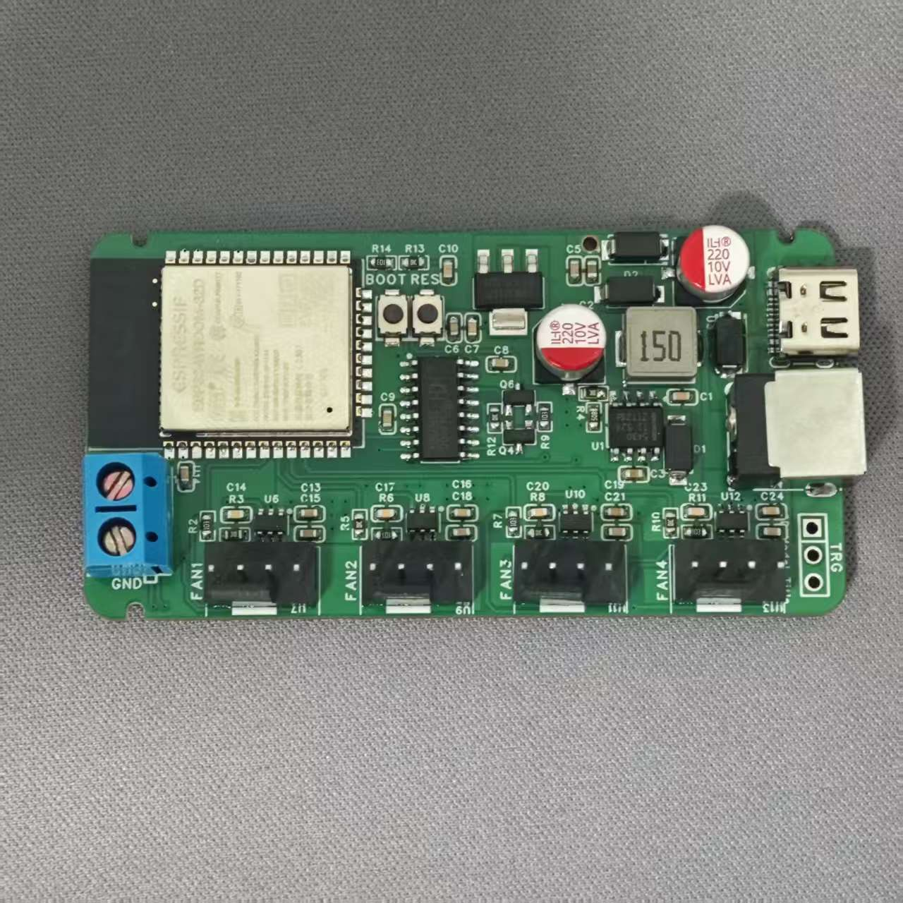
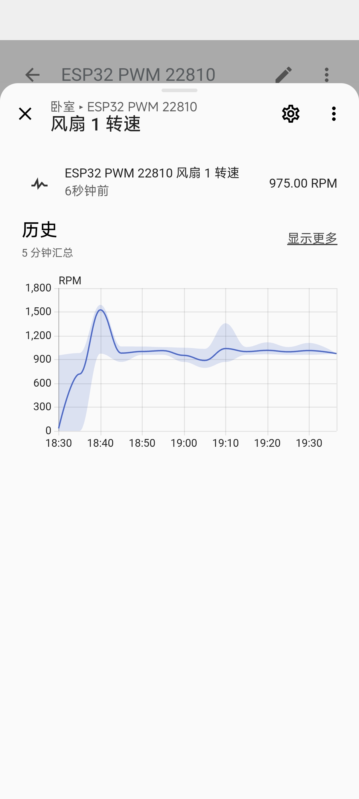

# HomeAssistant-PWM-Fan-Controlx4

## 项目简介

 HomeAssistant-PWM-Fan-Controlx4 是一个基于 ESPHome 的 PWM 风扇控制器项目。该控制器支持接入 Home Assistant，实现 4 路风扇的独立调速与智能联动控制。
  `key: "LqGIGJ3qyRc+6X6hsMe5vAms+Jyh2lOMh1FQu8yyuzk="`

## 更新日志

### [2026.06.11]
- **✨ 新增 Web 界面控制功能**：集成 `web_server` 组件，支持在局域网内通过浏览器（输入设备 IP）直接对 4 路风扇进行可视化开关与 1-100% 滑块调速，并开放了标准的 HTTP REST API 控制接口。
- **🔍 新增诊断实体**：引入 `uptime`、`wifi_signal`、`wifi_info` 及 `version` 平台。在 Home Assistant 中可自动归类生成设备运行时间、Wi-Fi 信号强度、局域网 IP 地址以及 ESPHome 固件版本等诊断型实体，方便日常维护与状态监控。

## 主要功能

- 通过 ESPHome 集成 HomeAssistant 控制
- **支持 Web 网页端/HTTP API 直接控制与百分比调速**
- 支持 4 路风扇独立 PWM 调速及实时转速显示
- **内置完善的硬件与系统诊断实体**（在线时间、信号强度、IP等）
- 可通过 HomeAssistant 自动化联动温湿度传感器，实现环境温度/湿度驱动风速调节
- 可通过 SSH 读取设备 CPU 温度，并结合 HomeAssistant 自动化实现风速控制

## 项目展示

<div style="text-align: center;">
  <table>
    <tr>
      <td width="33%" style="padding: 10px;">
        
        </td>
      <td width="33%" style="padding: 10px;">
        
        </td>
      <td width="33%" style="padding: 10px;">
        
        </td>
    </tr>
  </table>
</div>


## 控制器硬件实现原理

本控制器的核心硬件设计如下：

- 使用 `TPS22810DBVR` 实现风扇电源控制。
  - 该芯片可直接切断风扇电源，从而有效解决风扇无法完全停转的问题。
- 12V 转 3.3V 电源采用 `TPS5430DDAR` DC-DC 降压芯片+`AMS1117-3.3` 线性稳压器先降至5V再降至3.3V。
  - 该方案效率高、发热低且有效降低为MCU供电的纹波。
- 板载 `CH340C` USB 转串口芯片。
  - 只需通过 Type-C 接口连接电脑即可直接烧录固件。

## IO 接口说明

| 风扇 | PWM 输出 | Tach 输入 | 电源管理 |
| ---- | -------- | --------- | -------- |
| Fan1 | GPIO16   | GPIO32    | GPIO21   |
| Fan2 | GPIO17   | GPIO33    | GPIO22   |
| Fan3 | GPIO18   | GPIO25    | GPIO23   |
| Fan4 | GPIO19   | GPIO26    | GPIO13   |

## HTTP REST API 接口说明

本项目集成了 Web Server，允许用户通过局域网发送 HTTP **POST** 请求来直接控制风扇。请将下表 URL 中的 `[设备IP]` 替换为控制器的真实局域网 IP，将 `[风扇编号]` 替换为 `1`、`2`、`3` 或 `4`。

>  **注意**：控制命令必须使用 **POST** 方法发送。由于设备默认采用中文命名且带有空格（例如：“风扇 2”），在组装 URL 时需要进行 URL 编码（即替换为 `%E9%A3%8E%E6%89%87%20[风扇编号]`）。

| 功能描述 | 请求方法 | 通用 API 接口 URL | URL 路径解码后内容 | 参数说明 |
| :--- | :---: | :--- | :--- | :--: |
| **打开风扇** | `POST` | `http://[设备IP]/fan/%E9%A3%8E%E6%89%87%20[风扇编号]/turn_on` | `/fan/风扇 [风扇编号]/turn_on` | 无 |
| **关闭风扇** | `POST` | `http://[设备IP]/fan/%E9%A3%8E%E6%89%87%20[风扇编号]/turn_off` | `/fan/风扇 [风扇编号]/turn_off` | 无 |
| **风扇调速** | `POST` | `http://[设备IP]/fan/%E9%A3%8E%E6%89%87%20[风扇编号]/turn_on?speed_level=[风速百分比]` | `/fan/风扇 [风扇编号]/turn_on?...` | `speed_level`：整数，范围 `1-100` |

*Python 调用示例：*
```python
import requests
# 开启 2 号风扇并调整至 50% 风速
requests.post("http://[设备IP]/fan/风扇 2/turn_on", params={"speed_level": 50})

## HomeAssistant 自动化配置

本项目支持通过 HomeAssistant 自动化实现智能风扇控制。以下示例展示如何配置一个根据温度传感器数值线性调速的自动化。

### 配置步骤

1. 打开 HomeAssistant
2. 进入 **自动化与场景** → **创建自动化** → **创建新的自动化**
3. 点击右上角 **更多** → **YAML 编辑**
4. 将下方的 YAML 代码复制粘贴到编辑器中
5. **修改实体 ID**（详见代码中的注释）
6. 保存自动化

### YAML 自动化配置

```yaml
alias: "通用智能风扇线性调速"
description: "根据温度传感器数值线性控制风扇 PWM 占空比"
mode: restart # 确保每次温度变化都能立即重新计算并覆盖旧任务

trigger:
  - platform: state
    entity_id: sensor.nas_temperature_x86_pkg_temp  # 【需修改】改为你自己的温度传感器实体 ID
    # 如果希望风扇不要过于灵敏，可以取消下面这一行的注释
    # for: "00:00:05" 

condition:
  # 检查传感器状态是否为有效数字，避免设备离线时自动化报错
  - condition: template
    value_template: "{{ is_number(states('sensor.nas_temperature_x86_pkg_temp')) }}" # 【需修改】这里的 ID 也要同步

action:
  - service: fan.set_percentage
    target:
      entity_id: fan.esp32_pwm_22810_feng_shan_1 # 【需修改】改为你自己的风扇实体 ID
    data:
      percentage: >
        {# 读取传感器数值 #}
         {# 【需修改】这里的 ID 也要同步 #}
        
        {# --- 自定义配置区域 --- #}
           {# 起控温度：低于此温度风速为 f_min #}
           {# 满载温度：高于此温度风速为 f_max #}
            {# 最低风速百分比 #}
          {# 最高风速百分比 #}
        {# --------------------- #}
        
        
          {{ f_min }}
        
          {{ f_max }}
        
          {# 线性计算公式 #}
          
          {{ result | round(0) | int }}
        
```

### 温度与风速关系图

若未修改上述配置中的最低/最高温度和风速参数（即保持默认值：最低温度 30°C、最高温度 50°C、最低风速 0%、最高风速 100%），温度与风速的线性关系如下图所示：


### 配置说明

- **起控温度（t_min）**：低于此温度时，风扇保持最低风速
- **满载温度（t_max）**：高于此温度时，风扇保持最高风速
- **最低风速（f_min）**：建议设为 0%，此时风扇完全停转
- **最高风速（f_max）**：建议设为 100%，风扇全速运转
- **线性调速**：在最低和最高温度之间，风扇风速将根据当前温度线性调节

## 交流群

<div style="text-align: center;">
  
</div>

## 请作者喝杯咖啡

<div style="text-align: center;">
  <table>
    <tr>
      <td width="50%" style="padding: 10px;">
        
        <p><small>微信</small></p>
      </td>
      <td width="50%" style="padding: 10px;">
        
        <p><small>支付宝</small></p>
      </td>
    </tr>
  </table>
</div>

## 二创项目

欢迎大家对本项目的硬件、软件甚至外壳进行二创和优化。如果你希望将自己的 Fork 项目展示在本项目中，请先联系我并提交你的修改说明。

审核通过后，你的项目将被展示在下方区域。

| 项目地址 | 项目说明 |
| ---- | -------- | 
| None | None   |

## 开源许可证

本项目采用 [MIT License](./LICENSE) 开源许可证。

有关详细信息，请参阅 [LICENSE](./LICENSE) 文件。
